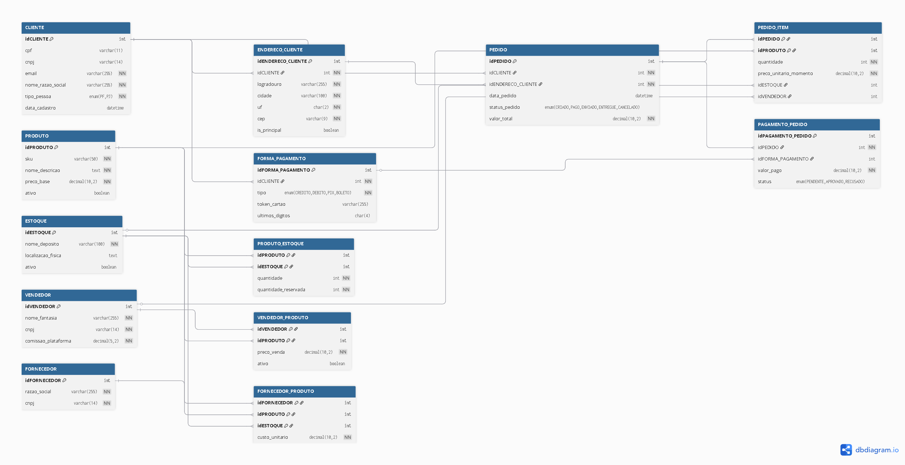

# Projeto E-commerce - Banco de Dados SQL

Trabalho prático de modelagem de banco de dados para um sistema de e-commerce.

## Objetivo
Criar o modelo lógico e físico de um banco de dados MySQL para suportar vendas online, com clientes, produtos, pedidos, estoque e fornecedores.

## O que foi feito

**1. Modelo Lógico**
Desenhei 13 tabelas no dbdiagram.io pra cobrir todo o fluxo: cadastro de cliente PF/PJ, produtos, vendedores terceiros, controle de estoque por depósito e rastreio de pedido.

**2. Scripts SQL**
- `schema.sql`: Cria o banco `ecommerce` e todas as tabelas com chaves primárias, estrangeiras e constraints.
- `inserts.sql`: Dados de teste pra popular o banco.
- `queries.sql`: 7 consultas pra responder perguntas de negócio, usando JOIN, GROUP BY, HAVING e ORDER BY.

**3. Principais Regras**
- Cliente pode ser Pessoa Física ou Jurídica, mas não os dois. Usei `CHECK` pra garantir isso.
- Um cliente pode ter vários endereços e várias formas de pagamento.
- Produto pode ter vários fornecedores. Decidi manter N:N na tabela `FORNECEDOR_PRODUTO` porque na prática um mesmo produto pode vir de distribuidores diferentes. Isso ajuda se um fornecedor ficar sem estoque.
- Separei `VENDEDOR` de `FORNECEDOR`. Vendedor é quem anuncia no site, fornecedor é quem entrega pro estoque.
- Adicionei campos de `status_entrega`, `codigo_rastreio` e `valor_frete` na tabela `PEDIDO` pra controlar a logística.
- Controle de estoque com `quantidade` e `quantidade_reservada` pra não vender produto que já tá num pedido em andamento.

## Diagrama

## Como rodar

1. Abre o MySQL Workbench
2. Roda o `schema.sql` pra criar as tabelas
3. Roda o `inserts.sql` pra colocar os dados
4. Testa as consultas do `queries.sql`

## Arquivos
'''
desafio-sql-ecommerce/
- `schema.sql` - Script DDL de criação
- `inserts.sql` - Script DML com dados de teste  
- `queries.sql` - Consultas SQL do desafio
- `modelo_logico.png` - Diagrama EER
